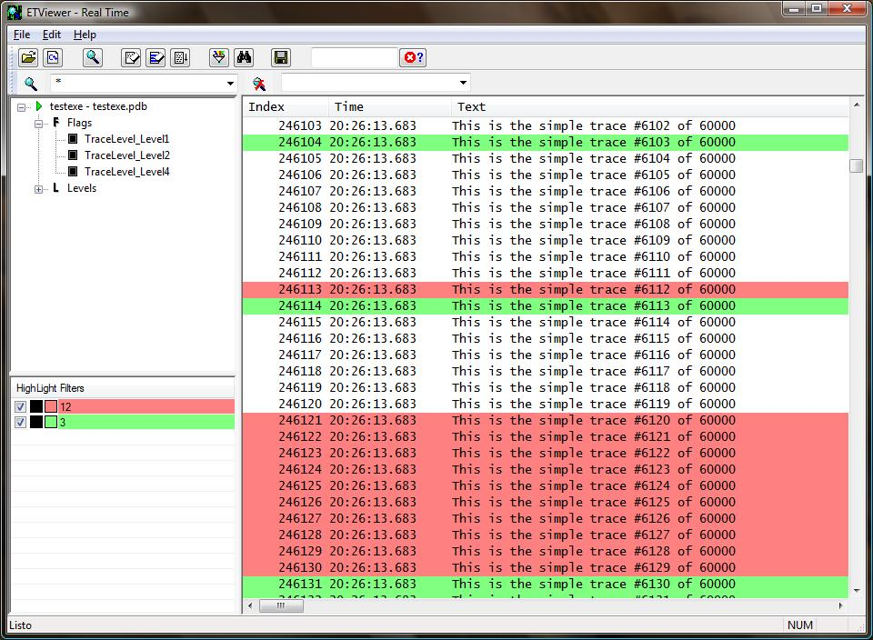

## Description

ETViewer is an alternative tool for [WPP Tracing](https://docs.microsoft.com/en-us/windows-hardware/drivers/devtest/wpp-software-tracing).
 
## Features

Supported session types

* Full Real time tracing.
* Full log file support (.etl).

Trace provider management

* PDB based (no .tmf/.tmc support).
* Complete trace provider management (Activation, Flags and Levels).
* Multiple concurrent providers in the same session.
* Multiple providers in the same PDB.

Trace management

* Search (to find, delete or mark traces).
* Mark (Visual Studio style).
* Highlight (coloring traces, DebugView style).
* Instant Exclusion/Inclusion filters for Real-Time tracing.
* Column sorting.

Other features

* Source code visualization with simple sintax highlight.
* Drag&Drop support.
* Clipboard support.
* Export to text file.
* File association support (optional).

Supported platforms

* Windows 7 and above

## Screenshots

